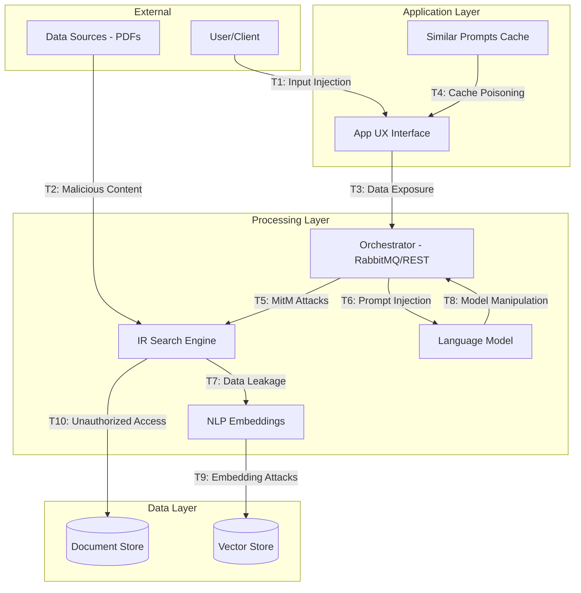

# LLM Security Threat Modeling Project

## Problem Statement
This project addresses the security challenges in implementing a Large Language Model (LLM) system for the Food and Agriculture Organization of the United Nations (FAO), specifically focusing on their document retrieval and analysis platform. The system processes sensitive food security and nutrition data, requiring robust security measures to protect against various threats while maintaining functionality.

### Key Challenges
- Securing sensitive data processing pipelines
- Protecting against LLM-specific vulnerabilities
- Ensuring data integrity throughout the system
- Managing access control and authentication
- Preventing unauthorized data exposure

## System Architecture
The system consists of several key components:

1. **Application Layer**
   - User Interface (App UX)
   - Similar Prompts Cache System

2. **Processing Layer**
   - Orchestrator (RabbitMQ/REST)
   - IR Search Engine
   - LLM Processing
   - NLP Embeddings

3. **Data Layer**
   - Document Store
   - Vector Embeddings Store

## Threat Model Diagram


## Identified Threats and Mitigations

### Critical Threats

1. **Input Injection (T1)**
   - Risk Level: HIGH
   - Mitigations:
     - Input validation
     - Sanitization
     - Rate limiting

2. **Data Exposure (T3)**
   - Risk Level: HIGH
   - Mitigations:
     - End-to-end encryption
     - Secure communication channels
     - Access controls

3. **LLM Vulnerabilities (T6)**
   - Risk Level: CRITICAL
   - Mitigations:
     - Prompt validation
     - Output filtering
     - Continuous monitoring

### Security Controls

#### Authentication & Authorization
- Multi-factor authentication
- Role-based access control
- Token-based authorization
- Regular access reviews

#### Data Protection
- Encryption at rest and in transit
- Data masking
- Secure key management
- Regular backups

#### Monitoring & Logging
- Real-time threat monitoring
- Comprehensive audit logging
- Anomaly detection
- Incident response procedures

## Implementation Guidelines

### Security Measures
1. **Input Validation**
   ```python
   def validate_input(user_input):
       # Input validation logic
       pass
   ```

2. **Authentication**
   ```python
   def authenticate_request(request):
       # Authentication logic
       pass
   ```

3. **Encryption**
   ```python
   def encrypt_data(data):
       # Encryption logic
       pass
   ```

### Deployment Security Checklist
- [ ] Enable TLS/SSL
- [ ] Configure firewalls
- [ ] Set up monitoring
- [ ] Implement logging
- [ ] Deploy WAF
- [ ] Regular security scans

